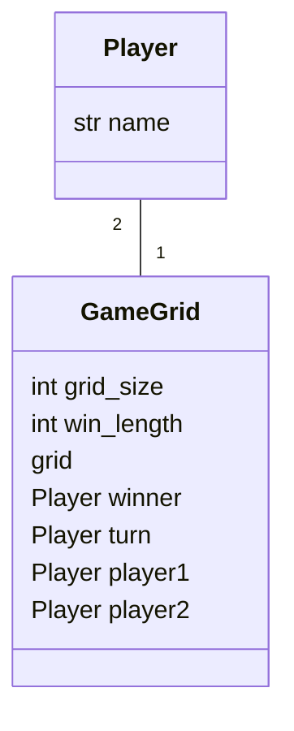

# Arkkitehtuurikuvaus

## Rakenne

## Käyttöliittymä
Käyttöliittymän näkymät

- Asetukset
- Pelinäkymä
- Huipputulokset

Jokaisella näkymällä on oma luokkansa. Vain yksi näkymä kerrallaan on esillä. Näkymien esittämisestä vastaa [UI](../src/ui/ui.py)-luokka

Aluksi käyttäjälle esitetään asetukset näkymä.

Mahdolliset siirtymät näkymien välillä:
- Asetukset  -> Pelinäkymä
- Pelinäkymä -> Huipputulokset
- Huipputulokset -> Pelinäkymä
- Huipputulokset -> Asetukset

## Sovelluslogiikka

Tietomallin muodostavat GameGrid ja Player

Sovelluksen toiminnallisuus on GameGrid luokan oliossa. 

## Tietojen pysyväistallennus

Lisätään myöhemmin
