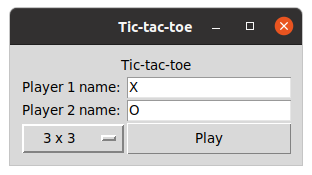
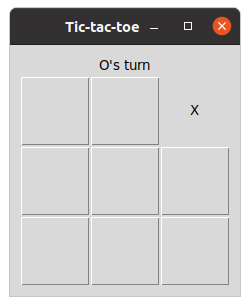
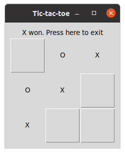
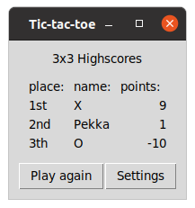

## Käyttöohje
Lataa viimeisin [release](https://github.com/elonheimo/ot-harjoitustyo/releases). 
Assets -> source code -> lataa tiedosto -> pura pakattu tiedosto

## Konfigurointi 

```DATABASE_FILENAME=database.sqlite```

Voit vaihtaa tietokannan nimeä muokkaamalla juurihakemistossa olevaa .env tiedostoa

## Ohjelman käynnistäminen 

Asenna riippuvuudet

```poetry install```

Käynnistä ohjelma

```poetry run invoke start```

## Ohjelman käyttäminen

### Asetusnäkymä

Sovellus käynnistyy asetusnäkymään

Valitse pelaajien nimet, sekä mieluisa pelimuoto



### Pelinäkymä

Pelaa peliä asettamalla merkkejä vuoron perään ruudukolle



Toisen pelaajan voitettua tai pelin päättyessä tasapeliin klikkaa ylhäällä olevaa tekstiä.




### Voittonäkymä

Tarkastele parhaimpia pelaajia 

Voit pelata uuden pelin tai palata asetuksiin valitsemaan vaikka eri pelimuodon.


