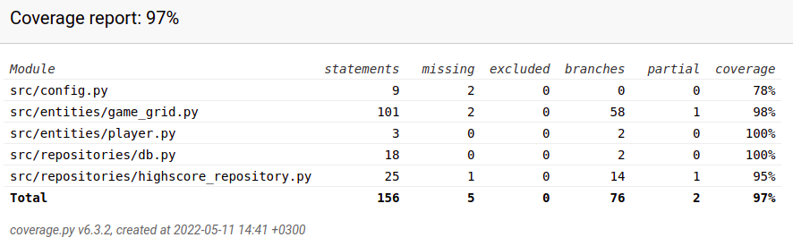

# Testausdokumentti

## Yksikkö ja integraatiotestaus

### Sovellulogiikka

Sovelluslogiikasta vastaavaa `GameGrid.py`-luokkaa testataan [GameGrid_test.py](../src/tests/entities/GameGrid_test.py)-testiluokalla.

### Repositorio

Repositorio-luokkaa `highscore_repository.py` testataan [highscores_repository_test.py](../src/tests/repositories/highscores_repository_test.py) luokalla. Testausta varten muodostettavan tietokannan nimi on tallennettettu [.env.test](/.env.test) tiedostoon.

### Testatuskattavuus

Sovelluksen testauksen haaraumakattavuus on 97%. Käyttöliittymää ei lasketa haaraumakattavuuteen.

## Järjestelmätestaus

Järjestelmätestaus on tehty manuaalisesti. 

### Asennus ja konfigurointi

Sovellus on ladattu ja asennettu käyttöohjeen mukaisesti Linux-ympäristöllä.

### Toiminnallisuudet

Kaikki [käyttöohjeen](../dokumentaatio/kayttoohje.md) listaamat toiminnallisuudet on testattu.