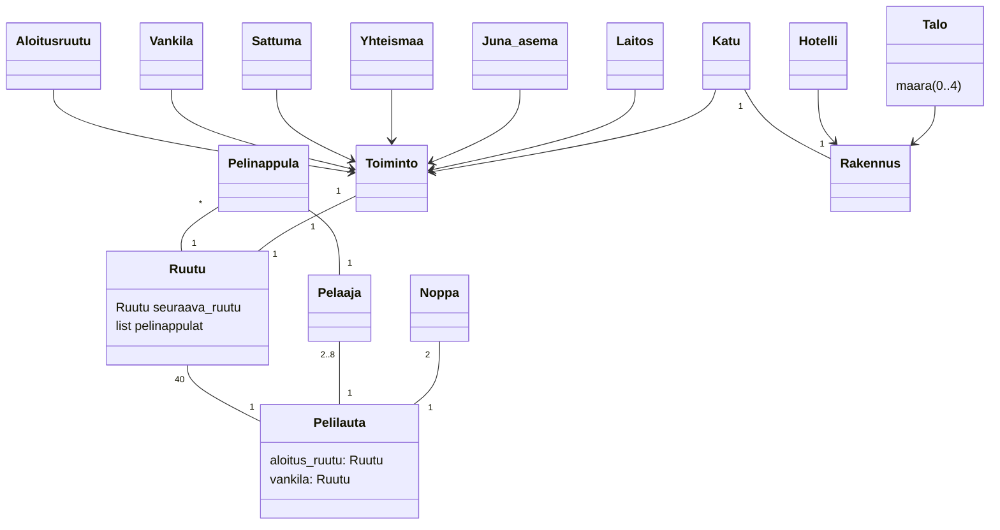

```mermaid
    classDiagram
        
        class Pelilauta {
            aloitus_ruutu: Ruutu
            vankila: Ruutu
        }

        Ruutu "40" -- "1" Pelilauta
        class Ruutu {
            Ruutu seuraava_ruutu
            list pelinappulat
        }
        
        Pelinappula "*" -- "1" Ruutu
        Pelinappula "1" -- "1" Pelaaja
        class Pelinappula {
            
        }

        Pelaaja "2..8" -- "1" Pelilauta
        class Pelaaja {

        }

        Noppa "2" -- "1" Pelilauta
        class Noppa{

        }

        Toiminto "1" -- "1" Ruutu
        class Toiminto {

        }

        Aloitusruutu --> Toiminto
        Vankila --> Toiminto
        Sattuma --> Toiminto
        Yhteismaa --> Toiminto
        Juna_asema --> Toiminto
        Laitos --> Toiminto
        Katu --> Toiminto
        

        Katu "1" -- "1" Rakennus
        class Rakennus {

        }

        Hotelli --> Rakennus
        class Hotelli{

        }
        Talo --> Rakennus
        class Talo {
            maara (0..4)
        }
``` 